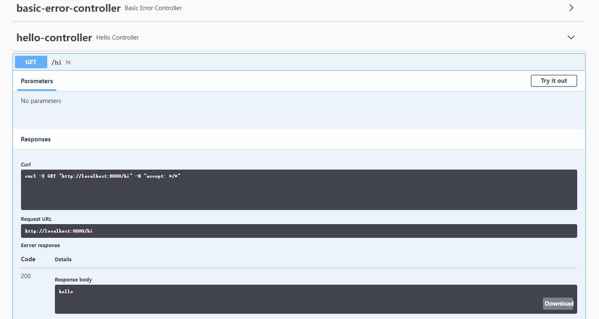

# springboot-swagger3

springboot+swagger3整合应用

> 参考: [https://blog.csdn.net/weixin_43740223/article/details/108491386](https://blog.csdn.net/weixin_43740223/article/details/108491386)

## swagger

Swagger 是一个规范和完整的框架，用于生成、描述、调用和可视化 RESTful 风格的 Web 服务

## 使用

- 添加依赖

```
<!-- swagger3 -->
<dependency>
    <groupId>io.springfox</groupId>
    <artifactId>springfox-boot-starter</artifactId>
    <version>3.0.0</version>
</dependency>
```

- 添加开关注解 @EnableOpenApi

```
@SpringBootApplication
@EnableOpenApi
public class Swagger3Application {

	public static void main(String[] args) {
		SpringApplication.run(Swagger3Application.class, args);
	}

}
```

- application.yml配置

```
spring:
  mvc:
    pathmatch:
      matching-strategy: ant_path_matcher
```

> 访问: http://localhost:8000/swagger-ui/

